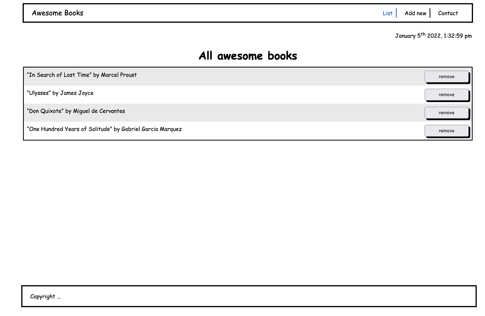

# My Awesome Book website
> "Awesome books" is a simple website that displays a list of books and allows you to add and remove books from that list. By building this application, you will learn how to manage data using JavaScript. Thanks to that your website will be more interactive.
\

## Built With
- HTML & CSS & JavaScript
- Html & Css linters
## Live Demo
### [LIVE DEMO LINK](https://aimemalaika.github.io/awsome-books/)
## Getting Started
- clone the repository by running\
    `git clone https://github.com/aimemalaika/awsome-books`
- navigate to the folder\
    `cd awsome-books`
## Authors 

👤 **Author1**
:bust_in_silhouette: **Aime Malaika**
- GitHub: [@aimemalaika](https://github.com/aimemalaika)
- Twitter: [@aimemalaika](https://twitter.com/Aime_Malaika)
- LinkedIn: [aimemalaika](https://linkedin.com/in/aimemalaika)

👤 **Author2**
:bust_in_silhouette: **Selma Belhadj**
- GitHub: [@selma-belhadj](https://github.com/selma-belhadj)
- Twitter: [@Bel_Selma16](https://twitter.com/Bel_Selma16)
- LinkedIn: [@selma-belhadj](https://www.linkedin.com/in/selma-belhadj/)

## :handshake: Contributing
Contributions, issues, and feature requests are welcome!
## Show your support
Give a :star:️ if you like this project!
## :memo: License
This project is [MIT](./MIT.md) licensed.